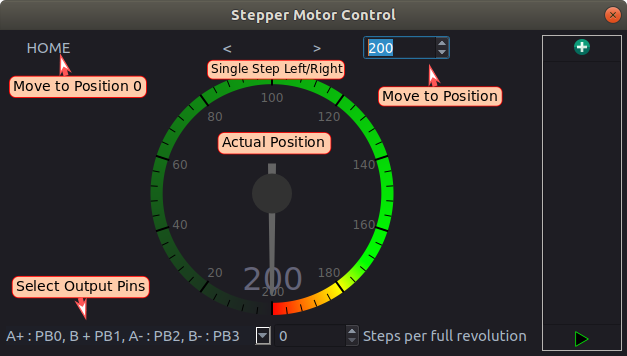

#built-in stepper motor sequence generator

Stepper motors move by taking precise steps. This means that the controller can move to a defined
position, and back to the starting position without errors. Motors can have large step sizes (20 steps per revolution), or very small (600/rev)

The kuttypy GUI can generate a full step sequence for controlling 4 wire stepper motors via PB0-PB3 pins.
Since the current driving capability of the ATMEGA32 is somewhat limited, it is
advisable to use a push-pull driver IC such as the L293D with larger motors.

## Procedure

- Launch the window from the menu on the bottom right side of the screen
- Connect 4 wire, 2 phase stepper motor's A+,B+,A-,B- to PB0, PB1, PB2, PB3
- use the left and right arrow buttons to take single steps
- home button to return to original position
- the numeric entry field to move to a different position

## Video of the stepping sequence
LEDs are connected to PB0-PB3 to show the stepping signal outputs

<video controls width="600">
    <source src="../images/stepper.webm"
            type="video/webm">
    Sorry, your browser doesn't support embedded videos.
</video>

## Applications

- Move a light sensor (TSL2561) along a diffraction pattern, and record the intensity profile
- Rotate the analyzer in a Malus's law experiment, and record the intensity variation which corresponds to IoCos^2(Theta)$ 
